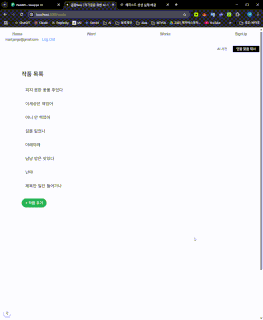

# 📚 Writer's Desk

작가를 위한 AI 기능이 포함된 단어장 서비스입니다.  
총 4명이 협업하여 프론트엔드, 백엔드, AI 기능 및 시스템 아키텍처를 구성했습니다.

---

## 🛠️ 기술 스택

- **Frontend**: Next.js, Tailwind CSS, TypeScript  
- **Backend**: FastAPI, PostgreSQL, SQLAlchemy  
- **AI**: Hugging Face Transformers, LangChain, OpenSearch, ComfyUI 기반 이미지 생성  
- **DevOps**: Docker, REST API, GitHub Actions

---

## 👨‍👩‍👧‍👦 팀 구성

| 이름 | 역할 |
|------|------|
| 임승환 | 백엔드 개발 |  |
| 장유진 | 프론트 개발 |  |
| 박범기 | AI 기능 및 이미지 생성 |
| 정윤정 | 아키텍처 설계 및 통합 |

---

## 🤖 AI 기능

- 예시 문장 자동 생성 (AI 기반)  
  

- AI 에이전트 동작  
  

## 📚 주요 기능 및 서비스 화면

<table>
  <tr align="center">
    <td><strong>예시 문장 자동 생성</strong></td>
    <td><strong>AI 에이전트 동작</strong></td>
    <td><strong>소셜 로그인</strong></td>
  </tr>
  <tr>
    <td></td>
    <td></td>
    <td></td>
  </tr>
  <tr>
    <td>입력된 단어 기반으로 AI가 예시 문장을 자동으로 생성합니다.</td>
    <td>AI 에이전트의 전체 동작 플로우를 GIF로 확인할 수 있습니다.</td>
    <td>Google OAuth를 통한 간편 로그인 기능을 제공합니다.</td>
  </tr>

  <tr align="center">
    <td><strong>단어 등록</strong></td>
    <td><strong>단어 정렬</strong></td>
    <td><strong>단어 검색</strong></td>
  </tr>
  <tr>
    <td></td>
    <td></td>
    <td></td>
  </tr>
  <tr>
    <td>단어를 추가하여 단어장에 등록합니다.</td>
    <td>단어를 가나다순 등 기준으로 정렬합니다.</td>
    <td>원하는 단어를 빠르게 검색할 수 있습니다.</td>
  </tr>

  <tr align="center">
    <td><strong>AI 연관 단어 검색</strong></td>
    <td><strong>작품 등록</strong></td>
    <td><strong>세계관 등록</strong></td>
  </tr>
  <tr>
    <td></td>
    <td></td>
    <td></td>
  </tr>
  <tr>
    <td>입력 단어와 연관된 단어를 AI가 추론하여 보여줍니다.</td>
    <td>작품을 등록하여 설정, 등장인물 등을 관리할 수 있습니다.</td>
    <td>세계관을 설정하고 작품과 연결할 수 있습니다.</td>
  </tr>

  <tr align="center">
    <td><strong>에피소드 등록</strong></td>
    <td><strong>전체 작품 조회</strong></td>
    <td><strong>캐릭터 등록</strong></td>
  </tr>
  <tr>
    <td></td>
    <td></td>
    <td></td>
  </tr>
  <tr>
    <td>작품에 연결된 에피소드를 추가합니다.</td>
    <td>등록된 전체 작품 목록을 확인합니다.</td>
    <td>새로운 캐릭터를 생성하고 작품에 연결합니다.</td>
  </tr>

  <tr align="center">
    <td><strong>캐릭터 수정</strong></td>
    <td><strong>AI 캐릭터 이미지 생성</strong></td>
    <td><strong>설정 수정</strong></td>
  </tr>
  <tr>
    <td></td>
    <td></td>
    <td></td>
  </tr>
  <tr>
    <td>등록된 캐릭터의 이름, 설명, 세계관 등을 수정합니다.</td>
    <td>AI를 통해 캐릭터 외형 이미지를 생성합니다.</td>
    <td>사용자 설정(카테고리 등)을 변경합니다.</td>
  </tr>
</table>

