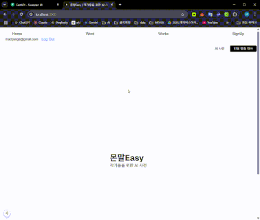
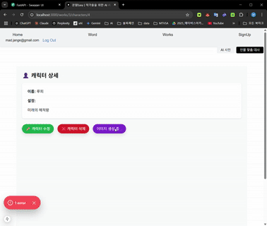

# 📚 Writer's Desk

작가를 위한 AI 기능이 포함된 단어장 서비스입니다.  
총 4명이 협업하여 프론트엔드, 백엔드, AI 기능 및 시스템 아키텍처를 구성했습니다.

---

## 📖 프로젝트 소개
기간 : 2025.05.19 ~ 2025.06.05
인원 : 4명
Writer's Desk는 작가들이 단어를 등록하고 관리할 수 있는 단어장 서비스입니다.
작품 설정, 등장인물 관리, 에피소드 작성 등 작가의 창작 활동을 지원하는 다양한 기능을 제공합니다.
이 서비스는 AI 기능을 통해 단어의 예시 문장을 자동 생성하고, 연관 단어를 추천하는 등 작가의 창작 과정을 도와줍니다.
캐릭터 이미지 생성 기능도 포함되어 있어, 작가가 설정한 캐릭터의 외형을 AI가 자동으로 생성해줍니다.

임베딩 데이터 : 한글 사전 데이터
https://huggingface.co/datasets/binjang/NIKL-korean-english-dictionary/viewer/default/train?p=531&views%5B%5D=train

임베딩 모델 : https://huggingface.co/snunlp/KR-SBERT-V40K-klueNLI-augSTS

LLM 모델 : GPT-4o-mini

---

## 🛠️ 기술 스택

- **Frontend**: Next.js, Tailwind CSS, TypeScript  
- **Backend**: FastAPI, PostgreSQL, SQLAlchemy
- **AI**: Hugging Face Transformers, AI Agent(LangChain, LangGraph), OpenSearch, ComfyUI 기반 이미지 생성  
- **DevOps**: Docker, REST API, Docker Compose, OpenSearch

---

## 👨‍👩‍👧‍👦 팀 구성

| 이름 | 역할 |
|------|------|
| 임승환 | 백엔드 API 개발(단어장, 작업, 에피소드, 캐릭터, 세계관, 기획 CRUD), DevOps 기반 시스템 아키텍처 설계 및 구축, 데이터베이스 설계, AI Agent API(RAG, Web Search, LLM기반) 개발 |
| 장유진 | 프론트 개발, 게스트 로그인, 구글 로그인 구현, DB Docker 기반 컨테이너 구축 |
| 박범기 | Comfy UI 기반 이미지 생성 기능 구현, LLM 기반 유사도 검색 기능 | 
| 정윤정 | Figma, ppt, UI, LLM 기반 AI 예문 생성기능, LLM 기반 단어 설명 기능 | 

---

### AI Agent 그래프

### 시스템 아키텍처

---

## 🤖 AI 기능

- 예시 문장 자동 생성 (AI 기반)  
  

- AI 에이전트 동작  
  

## 📚 주요 기능 및 서비스 화면

<table>
  <tr align="center">
    <td><strong>예시 문장 자동 생성</strong></td>
    <td><strong>유사한 단어 검색</strong></td>
    <td><strong>소셜 로그인</strong></td>
  </tr>
  <tr>
    <td></td>
    <td></td>
    <td></td>
  </tr>
  <tr>
    <td>입력된 단어 기반으로 RAG와 LLM기반으로 예시 문장을 생성합니다.</td>
    <td>LLM 기반 유사한 단어를 검색하는 기능입니다.</td>
    <td>Google OAuth를 통한 간편 로그인 기능을 제공합니다.</td>
  </tr>

   

  <tr align="center">
    <td><strong>단어 등록</strong></td>
    <td><strong>단어 정렬</strong></td>
    <td><strong>단어 검색</strong></td>
  </tr>
  <tr>
    <td></td>
    <td></td>
    <td></td>
  </tr>
  <tr>
    <td>단어를 추가하여 단어장에 등록합니다.</td>
    <td>단어를 조회수, 최신순 등 기준으로 정렬합니다.</td>
    <td>원하는 단어를 빠르게 검색할 수 있습니다.</td>
  </tr>

   

  <tr align="center">
    <td><strong>AI 연관 단어 검색</strong></td>
    <td><strong>작품 등록</strong></td>
    <td><strong>세계관 등록</strong></td>
  </tr>
  <tr>
    <td></td>
    <td></td>
    <td></td>
  </tr>
  <tr>
    <td>입력 단어와 연관된 단어를 AI가 추론하여 보여줍니다.</td>
    <td>작품을 등록하여 설정, 등장인물 등을 관리할 수 있습니다.</td>
    <td>세계관을 설정하고 작품과 연결할 수 있습니다.</td>
  </tr>

   

  <tr align="center">
    <td><strong>에피소드 등록</strong></td>
    <td><strong>전체 작품 조회</strong></td>
    <td><strong>캐릭터 등록</strong></td>
  </tr>
  <tr>
    <td></td>
    <td></td>
    <td></td>
  </tr>
  <tr>
    <td>작품에 연결된 에피소드를 추가합니다.</td>
    <td>등록된 전체 작품 목록을 확인합니다.</td>
    <td>새로운 캐릭터를 생성하고 에피소드 및 작품에 연결합니다.</td>
  </tr>

  <tr align="center">
    <td><strong>캐릭터 수정</strong></td>
    <td><strong>AI 캐릭터 이미지 생성</strong></td>
    <td><strong>설정 수정</strong></td>
  </tr>
  <tr>
    <td></td>
    <td></td>
    <td></td>
  </tr>
  <tr>
    <td>등록된 캐릭터의 이름, 설명, 세계관 등을 수정합니다.</td>
    <td>AI를 통해 캐릭터 외형 이미지를 생성합니다.</td>
    <td>사용자 설정(카테고리 등)을 변경합니다.</td>
  </tr>
  <tr align="center">
    <td><strong>기획 추가</strong></td>
    <td></td>
  </tr>
  <tr>
    <td>기획을 추가합니다.</td>
  </tr>
</table>

### 포팅 메뉴얼
1. **포팅 환경 설정**
   - Docker와 Docker Compose가 설치되어 있어야 합니다.
   - PostgreSQL 데이터베이스를 설정합니다.

